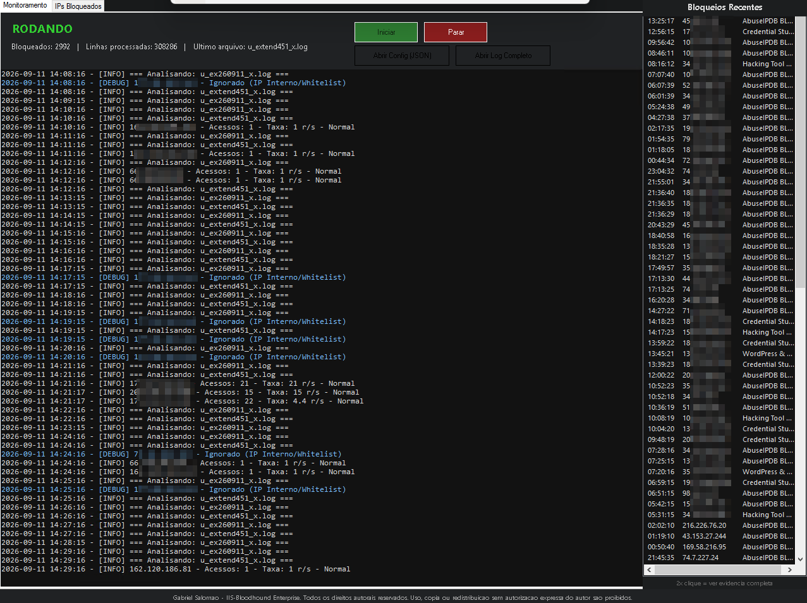
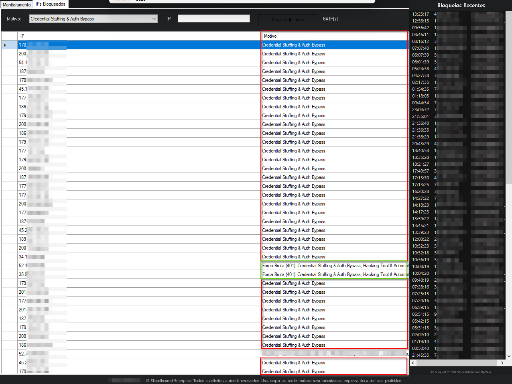
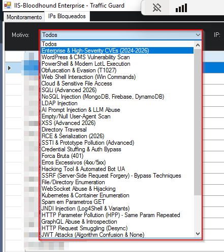

# 🔥🛡️ IIS-Fenrir Enterprise Edition - Host-Based Defense Architecture

> ⚠️ **Nota de Propriedade Intelectual (OpSec):**
> *O código-fonte completo (.ps1) e o catálogo de assinaturas de detecção do IIS-Fenrir não são públicos. Eles foram desenvolvidos como uma solução corporativa de defesa interna (Closed-Source / Corporate IP). Este repositório serve estritamente como uma **Documentação Arquitetural** para demonstrar a lógica de engenharia, a estruturação do projeto e os desafios superados, sem expor os artefatos sensíveis de detecção.*

## 📌 Visão Geral
Em ambientes de alto volume transacional, a dependência exclusiva de análise manual de logs gera uma janela de exposição (MTTR) crítica. O IIS-Fenrir é um motor de detecção de intrusão e resposta automatizada (HIPS - Host-based Intrusion Prevention System) desenvolvido nativamente em PowerShell e envelopado em uma robusta interface gráfica (GUI) em WinForms. Ele atua diretamente na camada de aplicação (Camada 7) em servidores Microsoft IIS.

Seu foco é detectar e conter ataques volumétricos, explorações clássicas da camada de aplicação e vetores modernos de ataque (como abusos de IA, vulnerabilidades JWT e SSRF) em tempo real, aplicando bloqueios dinâmicos via Windows Defender Firewall de forma totalmente autônoma.

---

## 🏗️ Arquitetura e Fluxo de Execução

O sistema foi desenhado para operar em servidores de missão crítica, priorizando resiliência, separação de processos e baixo impacto de I/O. O pipeline de detecção ocorre em cinco estágios:

### 1. Ingestão e Processamento Dinâmico (Event-Driven Reading)
Para evitar picos de CPU em arquivos de log que chegam a gigabytes:
* **Monitoramento por Eventos:** Utiliza `FileSystemWatcher` para reagir instantaneamente a alterações nos logs, eliminando o custo computacional de varreduras constantes (polling).
* **Leitura Incremental:** Implementa `System.IO.FileStream` e controle estrito de offset (`SeekOrigin`). O script processa apenas os bytes escritos desde a última interação.
* **Mapeamento Dinâmico & Proxy Aware:** Lê a diretiva `#Fields` (padrão W3C) para mapear colunas críticas. Inclui suporte nativo para identificar o IP real via `X-Forwarded-For`, garantindo eficácia mesmo atrás de Load Balancers ou CDNs.

### 2. Motor de Detecção e Engenharia de Regras (Deep Inspection)
Cada requisição passa por um funil de inspeção de alta fidelidade:
* **Catálogo Expansivo (32 Categorias):** Validação de tráfego contra um catálogo proprietário com mais de 30 categorias de ataque, incluindo *JWT Attacks (Algorithm Confusion)*, *AI Prompt Injection & LLM Abuse*, *GraphQL Abuse*, campanhas *ClickFix* e técnicas LotL modernas.
* **Análise Volumétrica:** Cálculo matemático da taxa de requisições por segundo (Req/s) para flagrar bots, Fuzzing e DDoS na camada 7.
* **Deep URL Decode (Anti-Evasão):** Rotina recursiva de decodificação de payloads (até 10 passagens). Isso anula tentativas de evasão por Double Encoding, expondo a real intenção do atacante antes da análise das assinaturas.

### 3. Enriquecimento e Inteligência (CTI & Honeytokens)
IPs suspeitos passam por uma camada extra de validação:
* **Honeytoken Defense:** Bloqueio imediato para IPs que acessam URIs de "isca" pré-definidas (ex: `/.env`, `/config.php`), assumindo intenção maliciosa instantânea sem necessidade de score prévio.
* **Threat Intelligence (AbuseIPDB):** Consultas em tempo real para reputação global com sistema de cache local para otimização de consultas.
* **Circuit Breaker & Key Rotation:** Sistema de rotação de chaves de API para evitar interrupções por limites de cota, garantindo que o motor local continue operando de forma autônoma.

### 4. Contenção Automatizada e SIEM Integration
Ao atingir o threshold de criticidade:
* **Active Response:** Criação dinâmica de regras de bloqueio inbound granulares no Windows Defender Firewall.
* **Saída Estruturada (JSON):** Geração nativa de logs estruturados em JSON (`IIS-Fenrir_WazuhAlerts.json`) para ingestão imediata por plataformas SIEM como o Wazuh, facilitando a observabilidade centralizada.
* **Alertas Analíticos:** Disparo de e-mails via SMTP para a equipe contendo indicadores de ataque (IoA) e as evidências brutas extraídas do log, com proteção DPAPI para a credencial de envio.

### 5. Interface Gráfica e Separação de Threads
A ferramenta opera através de uma arquitetura assíncrona avançada:
* **Runspace Dedicado:** Todo o motor de parsing e detecção roda de forma assíncrona em um Runspace PowerShell isolado.
* **GUI Responsiva:** A interface gráfica principal (WinForms) apenas consome filas thread-safe (`ConcurrentQueue`) para exibir as atualizações em tempo real (painel de logs, contadores e tabelas de IPs bloqueados), garantindo que a tela nunca congele durante ataques massivos.

---

## 🚀 Desafios Técnicos Superados

* **Arquitetura Assíncrona GUI vs Motor:** Implementação de Runspaces do PowerShell comunicando-se com a thread STA da interface WinForms exclusivamente via objetos thread-safe (`ConcurrentQueue`), permitindo alto desempenho sem travamentos.
* **Memory Safety:** Implementação de rotinas de limpeza de cache em memória para evitar vazamento de RAM em cenários de milhões de eventos processados.
* **Desacoplamento de Inteligência:** Toda a lógica de detecção (Thresholds, Regras Regex pré-compiladas e Honeytokens) é isolada em um arquivo `config.json` protegido. Isso permite ajustes de inteligência rápidos e "hot-swap" em produção, garantindo que o núcleo das assinaturas permaneça ofuscado e modularizado.
* **Resiliência de I/O:** Leitura incremental otimizada capaz de processar volumes massivos de logs sem causar degradação de performance nas aplicações hospedadas no IIS.

---

## 📸 Evidências de Operação (Sanitizadas)

*(Screenshots mascarados para preservação rigorosa dos dados sensíveis e lógica corporativa da infraestrutura).*

### 1. Monitoramento HIPS em Tempo Real
> **Nota:** A interface exibe o status de execução, processamento contínuo em *live tail*, identificação e classificação via cores das ações (Aviso, Erro, Alerta) e a trilha lateral de IPs bloqueados na sessão.

### 2. Auditoria e Contenção Host-Based
> **Nota:** A aba "IPs Bloqueados" lê dinamicamente as regras contidas nativamente no Windows Defender Firewall. É possível observar a correlação do IIS-Fenrir, que concatenou diferentes vetores (ex: *Credential Stuffing* e *Hacking Tool*) para aplicar o bloqueio autônomo no atacante.

### 3. Filtros Granulares de Threat Intelligence
> **Nota:** O dropdown apresenta a extração em tempo real das 32 categorias ativas mapeadas pelo motor (incluindo assinaturas para *CVEs Críticas*, vetores de *XSS Advanced* e mitigação de *Supply Chain*), permitindo a auditoria visual rápida de quais ameaças mais atingem o ambiente.

---
*Desenvolvido e arquitetado por [Gabriel Salomão](https://www.linkedin.com/in/gsalomao) - Todos os direitos reservados.*
